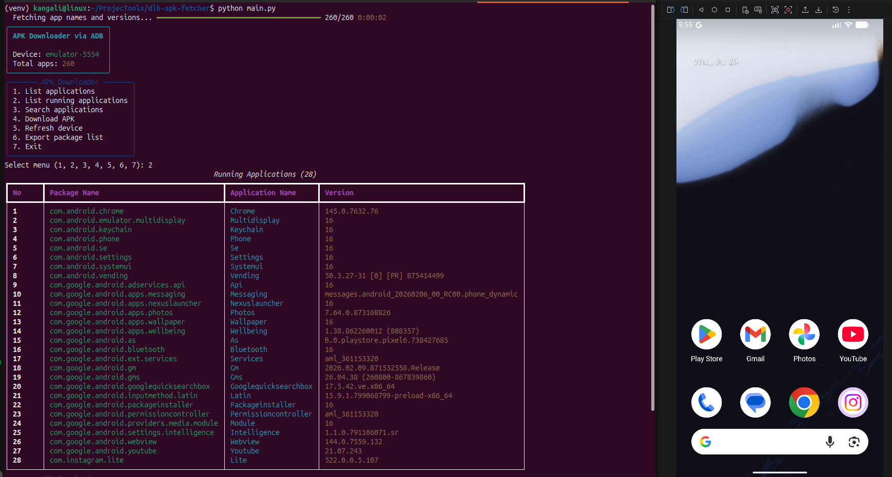

# DLH Apk Fetcher

<p align="center">
  
  
  
</p>


A Python CLI application for detecting Android devices connected through ADB, listing installed applications with names and versions, showing currently running applications, searching packages, and downloading APK files into a structured local folder.

This tool is designed to help prepare APK samples for further Android security analysis, especially when working with **Droid LLM Hunter**.

## Why This Tool Exists

**Droid LLM Hunter** is a tool for scanning Android applications for vulnerabilities using Large Language Models (LLMs).

Repository:
- https://github.com/roomkangali/droid-llm-hunter

Before an APK can be analyzed by Droid LLM Hunter, it first needs to be collected from a real device or emulator. **dlh-apk-fetcher** helps with that step by:

- detecting connected Android devices via ADB
- listing installed applications **with real application names and version info**
- showing applications that are currently running
- locating APK paths on the device
- downloading base APK and split APK files
- organizing the downloaded files per package

This makes it easier to extract APKs from test devices and move them into a workflow for static analysis, reverse engineering, or vulnerability scanning with Droid LLM Hunter.

<p align="center">
  
</p>

## Features

- Check whether `adb` is available on the system
- Detect connected Android devices or emulators
- Let the user choose a device if multiple devices are connected
- List all installed application packages with **application name** and **version**
- List currently running application packages with metadata
- Search packages quickly by keyword (searches both package name and application name)
- Select an application by number or package name
- Support **Split APK**
- Download all APK files related to the selected package
- Store downloads inside a dedicated folder per package
- **Parallel metadata fetching** — 20 concurrent ADB calls for fast startup (~2–3 seconds for 260 apps)
- **Smart caching** — metadata loaded once, reused across all menu options
- Export the package list to a tab-separated `.txt` file (with app name + version)
- Save logs to `logs/app.log`
- Professional CLI interface using `rich`
- Works on Windows, Linux, and macOS as long as `adb` is available in `PATH`

## Requirements

- Python 3.11+
- ADB / Android Platform Tools
- A physical Android device or emulator
- USB debugging enabled when using a physical device

## Installation

### 1. Clone or open the project directory

```bash
git clone https://github.com/roomkangali/dlh-apk-fetcher.git
cd dlh-apk-fetcher
```

### 2. Create a virtual environment (optional but recommended)

Linux/macOS:

```bash
python3 -m venv venv
source .venv/bin/activate
```

Windows PowerShell:

```powershell
py -3 -m venv .venv
.venv\Scripts\Activate.ps1
```

### 3. Install dependencies

```bash
pip install -r requirements.txt
```

## Install ADB

ADB is part of **Android Platform Tools**.

Official download:
- https://developer.android.com/tools/releases/platform-tools

### Linux
Install from your distribution package manager or download Android Platform Tools manually.

Verify:

```bash
adb version
```

### Windows
1. Download Android Platform Tools
2. Extract the ZIP archive
3. Add the extracted folder to your `PATH`
4. Verify:

```powershell
adb version
```

### macOS
Use the official Android Platform Tools package or Homebrew:

```bash
brew install android-platform-tools
adb version
```

## Running the Application

Run the following command from the `dlh-apk-fetcher` directory:

```bash
python main.py
```

Or, if your system uses `python3`:

```bash
python3 main.py
```

## Workflow

When the application starts, it will:

1. Check whether `adb` is available
2. Detect connected devices
3. Ask the user to select a device if multiple devices are available
4. Load all installed packages in parallel with progress bar
5. Show the main menu

Main menu:

```text
1. List applications
2. List running applications
3. Search applications
4. Download APK
5. Refresh device
6. Export package list
7. Exit
```

## Example Usage

### 1. List all installed applications

Choose:

```text
1
```

The application will display installed packages sorted alphabetically with **Application Name** and **Version** columns:

```text
                                 Installed Applications (260)                                 
┏━━━━━━━━┳━━━━━━━━━━━━━━━━━━━━━━━━━━━━━━┳━━━━━━━━━━━━━━━━━━┳━━━━━━━━━━━━━━━━━━━━━━━━━━━━━━━┓
┃ No     ┃ Package Name                 ┃ Application Name ┃ Version                       ┃
┡━━━━━━━━╇━━━━━━━━━━━━━━━━━━━━━━━━━━━━━━╇━━━━━━━━━━━━━━━━━━╇━━━━━━━━━━━━━━━━━━━━━━━━━━━━━━━┩
│ 1      │ com.android.chrome           │ Chrome           │ 145.0.7632.76                 │
│ 2      │ com.android.vending          │ Vending          │ 50.3.27-31                    │
│ 3      │ com.google.android.gm        │ Gm               │ 2026.02.09.871532558.Release  │
│ 4      │ com.google.android.youtube   │ Youtube          │ 21.07.243                     │
│ ...    │ ...                          │ ...              │ ...                           │
└────────┴──────────────────────────────┴──────────────────┴───────────────────────────────┘
```

### 2. List running applications

Choose:

```text
2
```

This shows only applications that currently have active processes on the Android device — with instant response since it reuses cached metadata (no re-fetch).

### 3. Search applications

Choose:

```text
3
```

Then enter a keyword, for example:

```text
chrome
```

Searches across both **package name** and **application name**, so you can search by either.

### 4. Download APK files

Choose:

```text
4
```

Then:
- enter a search keyword, or leave it blank to show all packages
- choose the package by number, for example `1`
- or enter the package name directly, for example:

```text
com.android.chrome
```

If the application uses split APKs, all related APK files will be downloaded.

Downloaded files are stored in a dedicated package folder, for example:

```text
downloads/
└── com.android.chrome
    ├── com_android_chrome_base.apk
    ├── com_android_chrome_split_chrome.apk
    ├── com_android_chrome_split_config.en.apk
    ├── com_android_chrome_split_dev_ui.apk
    ├── com_android_chrome_split_on_demand.apk
    ├── com_android_chrome_split_stack_unwinder.apk
    └── com_android_chrome_split_test_dummy.apk
```

### 5. Export package list

Choose:

```text
6
```

The package list will be saved as a tab-separated file at:

```text
downloads/packages.txt
```

With columns: `Package Name`, `Application Name`, and `Version`.

## Using the APKs with Droid LLM Hunter

After downloading APK files with this tool, you can use them as input material for your Android security analysis workflow.

Typical workflow:

1. Connect an Android device or emulator
2. Use **dlh-apk-fetcher** to extract the target application
3. Collect the resulting base APK and split APK files
4. Prepare the APK set you want to inspect
5. Use the APK with **Droid LLM Hunter** for vulnerability analysis

This is especially useful when:
- the APK is already installed on a device but not easily available elsewhere
- you need the exact version currently installed on a test device
- you want to inspect split APK packages from real-world installations
- you want to build a repeatable APK collection pipeline before LLM-based scanning

## Troubleshooting

### ADB not found

Message:

```text
ADB not found.
Please install Android Platform Tools first.
```

Solution:
- Make sure `adb` is installed
- Make sure `adb` can be executed from your terminal
- Add the ADB location to your `PATH`

Verify:

```bash
adb version
```

### No connected device/emulator found

Solution:
- Make sure an emulator is running, or
- Make sure the USB cable is connected properly
- Enable **USB debugging**
- Run:

```bash
adb devices
```

### Device offline / unauthorized

Solution:
- Reconnect the device
- Confirm the USB debugging authorization dialog on the device
- Restart ADB:

```bash
adb kill-server
adb start-server
adb devices
```

### Slow startup / metadata fetching

If the initial metadata fetch is slow:
- Make sure the ADB connection is stable (USB preferred over Wi-Fi)
- Reduce worker count if your system has limited resources (edit `workers=` in `_parallel_fetch_all`)
- Emulators may be slower than physical devices
